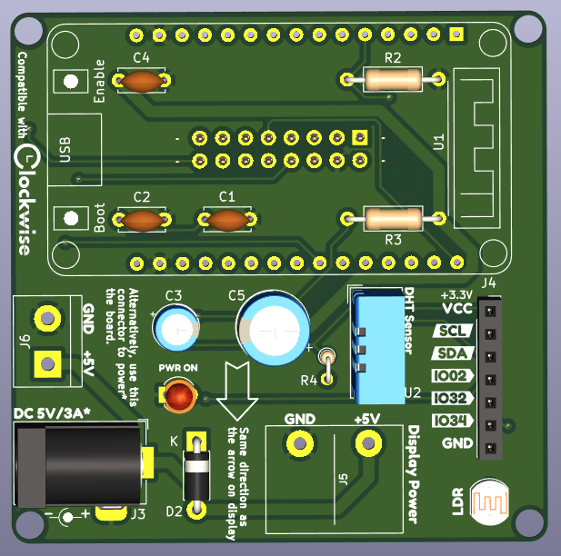
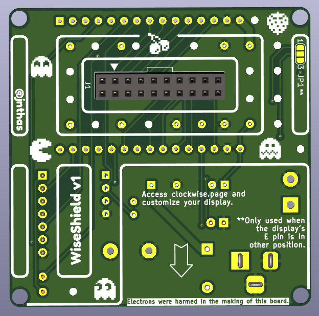

# WiseShield-32 Controller Board

WiseShield-32 is the first controller board developed for the [Clockwise project](https://github.com/jnthas/clockwise). It is designed for versatility, ease of assembly, and compatibility with popular display and peripheral modules.

## Overview

- **MCU**: ESP32 Dev Board (DOIT or compatible)
- **Purpose**: General-purpose, DIY-friendly board for driving various display and peripheral modules as part of the Clockwise ecosystem
- **Focus**: Maker-friendliness, modularity, and open-source design

## Repository Structure

- **gerbers/**: Production files ready for PCB manufacturing (Gerber files, drills, and Bill of Materials)
- **kicad/**: Complete schematic, PCB design files, 3D models, symbols, footprints, and renders (PNG, SVG)
    - Libraries folder contains custom symbols and footprints.
    - Placement folder contains component placement files.

### Key Files

- `gerbers/Wise-Shield-32-BOM.csv`: Full Bill of Materials with component reference
- `gerbers/Wise-Shield-32-*.gbr`: Individual Gerber layers for PCB fabrication
- `kicad/Wise-Shield-32.kicad_sch`: Schematic (KiCad)
- `kicad/Wise-Shield-32.kicad_pcb`: Board layout (KiCad)
- `kicad/Wise-Shield-32-brd.png` and `kicad/Wise-Shield-32-brd.svg`: Board visualizations
- `kicad/libraries/`: Custom footprints, 3D models, and schematic symbols

## Features

- Compatible with standard ESP32 Dev Boards
- HUB75 and other display connector footprints available
- Designed for both experimental and permanent installations
- All files provided for at-home or commercial PCB assembly

## Getting Started

1. Clone the repository
2. Review schematic and BOM
3. Manufacture the PCB using the provided Gerber files, or edit the design using KiCad
4. Assemble and populate components as described in the BOM

## Assembly

This board can be assembled by hand, with through-hole and standard SMD (where applicable) components. See the BOM and placement files for specific guidance.

## License

This project is licensed under the MIT License. See the [main repository](../../README.md) for details.

## About Clockwise

For details on the Clockwise project, usage examples, and broader ecosystem, visit: [github.com/jnthas/clockwise](https://github.com/jnthas/clockwise)

---

For questions or improvements, open an issue or submit a pull request!

